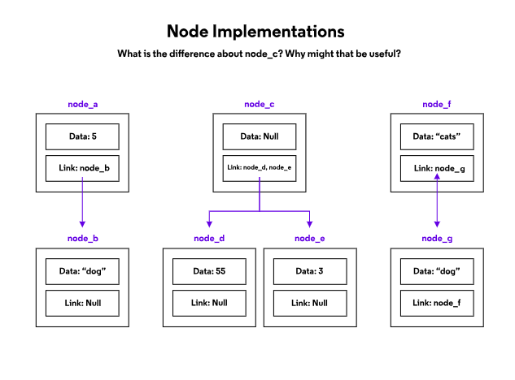

Nodes are the fundamental building blocks of many computer science data structures. They form the basis for linked lists, stacks, queues, trees, and more.

-   Nodes contain data, which can be a variety of data types.
-   They also contain links to other nodes. If a node has no links, or they are all null, you have reached the end of the path you were following.
-   Nodes can be orphaned if there are no existing links to them.

